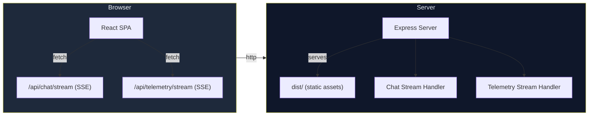

# AI Chatbot Front-End with Real-Time SSE Streaming

## Table of Contents

- [Overview](#overview)
- [Features](#features)
- [Tech Stack](#tech-stack)
- [Architecture](#architecture)
- [Getting Started (Development)](#getting-started-development)
- [Production Build & Deployment](#production-build--deployment)
- [Scripts](#scripts)
- [Folder Structure](#folder-structure)
- [Live Streaming (SSE) Details](#live-streaming-sse-details)
- [Testing the Real-Time UI](#testing-the-real-time-ui)
- [Contributing](#contributing)
- [License](#license)

---

## Overview

This repository contains a **React front-end** for an AI chatbot that communicates with a **Node.js/Express Server-Sent Events (SSE) gateway**.

The UI streams **LLM tokens** and **telemetry events** in real time, delivering a modern, vibrant experience (dark mode, glass-morphism, micro-animations).

> The back-end lives in `server/server.js`. In development the React app is served by Vite and proxies `/api/*` to the gateway. In production the gateway serves the static `dist/` folder itself.

---

## Features

- Real-time token streaming (`POST /api/chat/stream`).
- Live telemetry (`GET /api/telemetry/stream`) with simulated webhook events.
- Responsive UI built with vanilla CSS, Inter font, and subtle animations.
- Production-ready static serving with SPA fallback.
- Development proxy via Vite (no CORS headaches).
- Graceful fallback when the SSE server is offline (error toast).
- Dockerfile for containerised deployment.

---

## Tech Stack

| Layer         | Technology                                        |
|---------------|---------------------------------------------------|
| Front-end     | **React 19** + **Vite 8**                         |
| Styling       | Vanilla CSS, CSS variables, custom animations     |
| Back-end      | **Node.js 20** + **Express 5**                    |
| Real-time     | **Server-Sent Events (SSE)** (`text/event-stream`) |
| Build/Package | npm scripts, optional **PM2** or **Docker**       |

---

## Architecture



The React app talks directly to the same-origin server for SSE, eliminating CORS complexities in production.

---

## Getting Started (Development)

```bash
# 1. Clone the repository
git clone <REPO_URL>
cd "proj#1"

# 2. Install dependencies
npm ci

# 3. Run the two processes (in separate terminals)
# Terminal 1 - Vite dev server (frontend)
npm run dev

# Terminal 2 - SSE gateway (backend)
npm run server
```

The Vite dev server proxies any request matching `/api/*` to `http://localhost:3001`.

Open <http://localhost:5173>. The **Chatbot Test** modal streams tokens as they arrive.

---

## Production Build & Deployment

### 1. Build the static bundle

```bash
npm run build   # creates ./dist
```

### 2. Start the production server

```bash
npm run start   # runs node server/server.js

# or a single command that builds, then starts
npm run prod
```

The server:

- Serves `dist/` via `express.static`.
- Handles `/api/chat/stream` and `/api/telemetry/stream`.
- Falls back to `dist/index.html` for any SPA route.

### Running as a daemon (optional)

```bash
npm i -g pm2
pm2 start server/server.js --name ai-chatbot
pm2 save
pm2 startup
```

> **Windows:** `pm2 startup` is not supported on Windows. Use [`pm2-windows-startup`](https://www.npmjs.com/package/pm2-windows-startup) or `pm2-installer` to register the service.

### Docker deployment (optional)

`Dockerfile`:

```dockerfile
# ---- Build stage ----
FROM node:20-alpine AS builder
WORKDIR /app
COPY package*.json ./
RUN npm ci
COPY . .
RUN npm run build

# ---- Runtime stage ----
FROM node:20-alpine
WORKDIR /app
COPY --from=builder /app/package*.json ./
COPY --from=builder /app/dist ./dist
COPY --from=builder /app/server ./server
RUN npm ci --omit=dev
EXPOSE 3001
CMD ["node", "server/server.js"]
```

Build and run:

```bash
docker build -t ai-chatbot .
docker run -p 80:3001 ai-chatbot
```

---

## Scripts

| Script        | Description                                                  |
|---------------|--------------------------------------------------------------|
| `dev`         | Launch Vite dev server (`vite`).                             |
| `server`      | Launch SSE gateway (`node server/server.js`).                |
| `build`       | Create a production-optimized Vite bundle (`dist/`).         |
| `start`       | Run the Express SSE server (serves static files).            |
| `prod`        | One-liner: `npm run build && npm run start`.                 |
| `lint`        | Run `oxlint` on the codebase.                                |
| `preview`     | Preview the built bundle locally (`vite preview`).           |
| `postinstall` | Patch Vite's URL-hash regex for Windows paths containing `#`. |

---

## Folder Structure

```text
proj#1/
├── package.json
├── vite.config.js
├── README.md
├── .oxlintrc.json
├── scripts/
│   └── fix-vite.js
├── src/                        # React source
│   ├── components/             # UI components (Dashboard, Navbar, etc.)
│   ├── context/
│   │   └── ChatbotContext.jsx
│   └── services/
│       └── api.js              # API helpers (streamChatMessage)
├── server/                     # Express SSE gateway
│   └── server.js
└── dist/                       # Produced by `npm run build`
```

---

## Live Streaming (SSE) Details

### Chat endpoint: `POST /api/chat/stream`

Request payload:

```json
{
  "message": "Your user prompt",
  "bot": {
    "name": "AI Assistant",
    "platform": "Web",
    "model": "GPT-4o",
    "intents": ["faq", "order", "support"]
  }
}
```

Response: a series of SSE `data:` events, each containing a JSON object:

```json
{ "token": "word", "done": false }
```

The final event is:

```json
{ "done": true }
```

### Telemetry endpoint: `GET /api/telemetry/stream`

Emits a JSON payload every 6 seconds with random platform/action data:

```json
{
  "type": "webhook_ping",
  "platform": "Slack",
  "action": "Intent classification verified",
  "timestamp": "14:32:07",
  "latency": "123ms"
}
```

The front-end consumes the telemetry stream with the native `EventSource` API. The chat stream is a `POST`, which `EventSource` does not support, so it is read with `fetch` and a `ReadableStream` reader. Both are wrapped in `src/services/api.js` (`streamChatMessage`).

---

## Testing the Real-Time UI

1. Run `npm run prod` (or start the Docker container).
2. Open the app in a browser.
3. Click **Chatbot Test** and type a short prompt (e.g. "hello").
4. Watch the response stream in with the pulsing cursor animation.
5. Verify the Navbar badge reads **Gateway Active** and the telemetry counter increments.

If the badge turns red, the SSE connection failed. Check the server console for errors.

---

## Contributing

Contributions are welcome:

1. Fork the repository.
2. Create a feature branch: `git checkout -b feature/awesome-thing`.
3. Install dependencies and run lint: `npm ci && npm run lint`.
4. Make your changes and add tests if applicable.
5. Submit a Pull Request with a clear description. For UI changes, include screenshots or GIFs.

---

## License

MIT License. See the [LICENSE](LICENSE) file for the full text.

Happy hacking! 🎉
